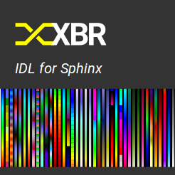

XBR IDL for Sphinx
==================

| |Version| |Build Status| |Docs|

Overview
--------

**XBR IDL for Sphinx** is an extension for
`Sphinx <https://sphinx.readthedocs.io/>`_
that allows to **define XBR interfaces** in an
`IDL <https://en.wikipedia.org/wiki/Interface_description_language>`_ 
that is embedded in documentation written in
`reStructuredText <https://en.wikipedia.org/wiki/ReStructuredText>`_
.

Once you have your XBR interfaces defined in XBR IDL, you can:

* generate developer documentation for the interfaces in HTML format
* load interface definitions into Crossbar.io for interface 

Links
-----

- Source: https://github.com/xbr/sphinxcontrib-xbr
- Bugs: https://github.com/xbr/sphinxcontrib-xbr/issues

.. |Version| image:: https://img.shields.io/pypi/v/sphinxcontrib-xbr.svg
   :target: https://pypi.python.org/pypi/sphinxcontrib-xbr

.. |Build Status| image:: https://travis-ci.org/xbr/sphinxcontrib-xbr?branch=master
   :target: https://travis-ci.org/xbr/sphinxcontrib-xbr

.. |Docs| image:: https://img.shields.io/badge/docs-latest-brightgreen.svg?style=flat
   :target: https://sphinxcontrib-xbr.readthedocs.io/en/latest/
